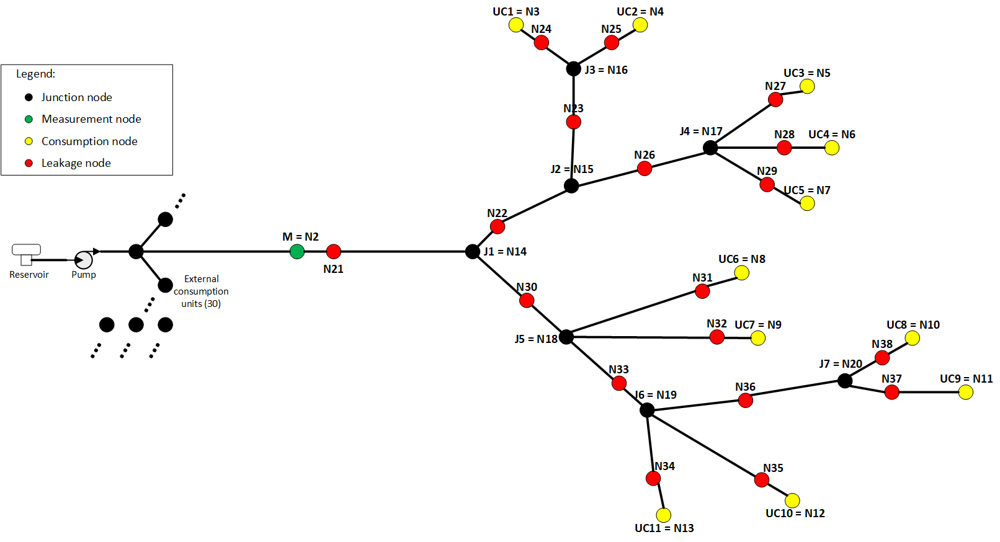

## Files for Case 2

---

## WDN overview

This WDN contains 11 consumption units (yellow dots) and 7 joint nodes (black dots). Leakage can be simulated in the red nodes. We did not enable two or more leakage points at once in our research. Leakage is pressure-dependant, using the emitter coefficient feature on EPANET. 

The CSV file is structured as follows:
* Column 1: time (in seconds)
* Columns 2-20: flow on monitored nodes (N2-N13)
* Columns 21-39: pressure on monitored nodes (N2-N13)
* Columns 40-58: volume on monitored nodes (N2-N13)
* Columns 59-77: x coordinates of monitored nodes (N2-N9)
* Columns 78-96: y coordinates of monitored nodes (N2-N9)
* Columns 97-115: z coordinates of monitored nodes (N2-N9)
* Columns 116-133: indicate absence (0) or presence (1) of leakage on nodes N21-N37
* Columns 134-136: x-y-z coordinates of the active leakage (if there are none, they are filled with zeros)
* Column 137: weekday (reserve/future use)

---

## EPANET model

The editable WDN model is the file 'case2.inp'. You can open and edit it using EPANET (free, open-source). 

---

## MATLAB code

The MATLAB code used to produce the CSV datasets is in the file 'case2.m'. It uses the EPANET-MATLAB Toolkit (https://github.com/OpenWaterAnalytics/EPANET-Matlab-Toolkit) and some custom functions that we provided in the root folder (CustomFunctions.rar).

---

## CSV data sets

The MATLAB code used to produce the CSV datasets is in the file 'case2.m'. It uses the EPANET-MATLAB Toolkit (https://github.com/OpenWaterAnalytics/EPANET-Matlab-Toolkit) and some custom functions that we provided in the root folder (CustomFunctions.rar). Unfortunately, GitHub does not allow files bigger than 25 MB, so we weren't able to update the full CSV package. But the 'CSV datasets' folder contains some files so you can check the dataset structure. You can generate the whole dataset using the Matlab code. 

---

## Python files

The file 'preprocess-case2' converts the CSV data sets to Tensor format. To use it, place the CSV files inside a folder named 'Original_Data' and create an empty folder named 'work_dir'. The Python code will output the tensor files to the 'work_dir' folder.

The file'GGNN-case2' runs the GGNN algorithm using the tensor files. It outputs the training/validation statistics of each training/validation pair to the folder 'work_dir2' and a binary Pickle file to the folder 'results'. Thus, you can open these files to generate the box plots and perform other kinds of analysis.

