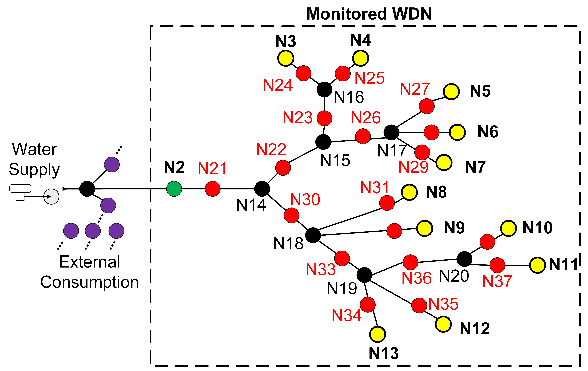

## WDN overview

This WDN contains 11 consumption units (yellow dots) and 7 joint nodes (black dots). Leakage can be simulated in the red nodes. We did not enable two or more leakage points at once in our research. Leakage is pressure-dependant, using the emitter coefficient feature on EPANET. As GitHub does not allow files bigger than 25 MB, we had to compress the CSV files using WinRAR. 

The CSV file is structured as follows:
* Column 1: time (in seconds)
* Columns 2-20: flow on monitored nodes (N2-N20)
* Columns 21-39: pressure on monitored nodes (N2-N20)
* Columns 40-58: volume on monitored nodes (N2-N20)
* Columns 59-77: x coordinates of monitored nodes (N2-N20)
* Columns 78-96: y coordinates of monitored nodes (N2-N20)
* Columns 97-115: z coordinates of monitored nodes (N2-N20)
* Columns 116-133: indicate absence (0) or presence (1) of leakage on nodes N21-N38
* Columns 134-136: x-y-z coordinates of the active leakage (if there are none, they are filled with zeros)
* Column 137: weekday (reserve/future use)

