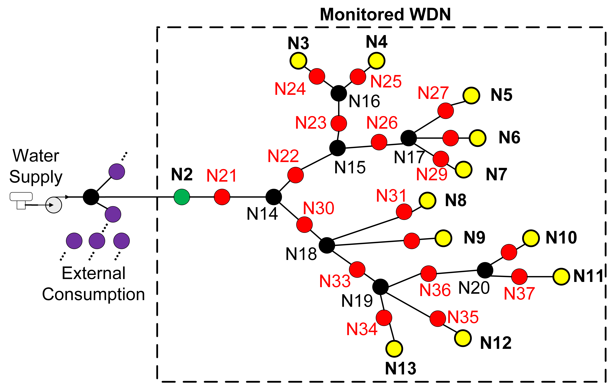

# Full paper 
The full paper is available at [IEEEXplore](https://ieeexplore.ieee.org/abstract/document/10584129/).
Citation info (BibTex):

<pre><code>@inproceedings{rolle2024leveraging,
  title={Leveraging graph-based leak localization in water distribution networks},
  author={Rolle, Rodrigo P and Rodrigues, Weliton C and Tomazini, Lucas R and Monteiro, Lucas N and Godoy, Eduardo P},
  booktitle={2024 IEEE International Workshop on Metrology for Industry 4.0 \& IoT (MetroInd4. 0 \& IoT)},
  pages={192--197},
  year={2024},
  organization={IEEE}
}
</code></pre>

# Dataset description

The  WDN  that was used for our case study represents a residential area inside an urban WDN supplied by the regular water supply services. Pipe lengths vary from 50 to 900 meters. The color code of the WDN nodes is as follows:
- Purple (30 nodes): water consumption units outside the monitored WDN;
- Green (1 node): inlet water meter of the monitored WDN;
- Yellow (11 nodes): water consumption units (houses) inside the monitored WDN;
- Black (7 nodes): junction nodes (pipe derivations);
- Red (18 nodes): leakage nodes.

We developed five datasets for the original version of the WDN. Each dataset included 100 days without leakage and 100 days with active leakage in a leakage node (red dots in the WDN map), totaling 1900 days. The five seeds used in the random number generator produced different randomizations of consumption patterns in the WDN, thus providing a variety of consumption scenarios in the datasets. The same standard was implemented for two stretched versions of the WDN: in the first, we multiplied all pipe lengths by two and in the second, we multiplied pipe lengths by 10. Thus, this case study relied on 15 1900-day datasets (5 different seeds for each of the 3 WDN sizes). The CSV files are available at the "Dataset.rar" file, which was splitted for size reasons.

The source files used to produce this dataset were the EPANET file "case-study-map.inp" and the Matlab script "dataset_metroind24.m", which also uses the custom functions available at [matlab](https://github.com/gasiepgodoy/WDN-Models-and-Data-Sets/tree/02ed1df57c0dbafa6b11efec9c4929e7cbcaa202/matlab).

# Reusing the dataset or building your own version

First and foremost, install the [EPANET-Matlab Toolkit](https://github.com/OpenWaterAnalytics/EPANET-Matlab-Toolkit). Then, download the 'inp' file and try to run the Matlab script. Finally, edit the map at your will (use EPANET and export a new 'inp' file) and use the provided Matlab script as a template to create your own variations. 

# Deploying the GNN algorithm

1. Create a folder to place the necessary files
2. Include the folders 'config' and 'model' as subfolders
3. Paste the CSV files to a subfolder named 'Original_Data'
4. Create an empty folder named 'work_dir' - the preprocessing algorithm will read the CSV files, convert them to Torch files and store them into it
5. Create an empty folder named 'work_dir2' - the GNN algorithm will output training and validation data
6. Create an empty folder named 'results' - the GNN algorithm will output a Pickle file containing the results of the execution
7. Create an empty folder named 'FilesWreg' - the linear regression algorithm will output new CSV files with the corresponding estimations
8. Run the 'preprocessing.py' algorithm to convert CSV files to Torch files
9. Run the 'main.py' algorithm to execute the training/validation

